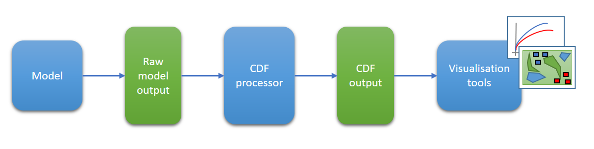

# SWAP - Common Data Format Processor for Command PE

**The Common Data Format processor software is licensed under the Apache License, Version 2.0 (the "License") you may not use the software except in compliance with the License. A copy of the license is
incldued within this repository: [LICENSE.txt](LICENSE.txt)**

**Unless required by applicable law or agreed to in writing, software
distributed under the License is distributed on an "AS IS" BASIS,
WITHOUT WARRANTIES OR CONDITIONS OF ANY KIND, either express or implied.
See [LICENSE.txt](LICENSE.txt) for the specific language governing permissions and
limitations under the License.**

## Simulation & Wargaming Analytical Pipeline

The Simulation & Wargaming Analytical Pipeline (SWAP) is a collection of Dstl developed tools and visualisations that aims to standardise and improve quantitative analysis of combat models. A critical component of the SWAP is the Common Data Format (CDF) which standardises the way model output is stored. This repo is the first part of the SWAP tool set to be open sourced and contains the software to convert model output from Command Professional Edition into the CDF. This repo does not contain any of the SWAP visualisation or analysis tools which may be released at a later date.

## What is the idea of the Common Data Format?

The core concept underpinning the Common Data Format (CDF) is that combat models, simulations and wargames consist of interacting entities and that these interactions can be expressed in a way that is agnostic of their source.

In practical terms the CDF enables outputs from different sources to be captured in a consistent, machine and human-readable format that can be easily visualised.

## What does the Common Data Format Processor do? 

The CDF processor converts raw output from supported models into CDF outputs ([CDFOutputs.md](processor_core/Vignettes/CDFOutputs.md)).

**It is entirely the responsibilty of the user to carry out sufficient manual checks to assure themselves that any Common Data Format outputs generated are an accurate representation of the raw outputs.**

This repository contains the CDF processor for the Command PE model. Processors for additional models and the core processor elements are contained in separate repositories within the Commercial Off The Shelf (COTS) CDF project.

## Sounds great! What do I need to get started using the Common Data Format with Command PE?

First of all you will need a Python set up as described in the next section (*note that no Python coding knowledge is required as there is no need to interact with any of the CDF processor Python code directly*).

You will also need to either download or clone this repository. 

Finally, you will also need some Command PE output files to process into CDF outputs ([CDFOutputs.md](processor_core/Vignettes/CDFOutputs.md)). For each Command PE run to be processed the unit position, weapon endgame and unit destroyed files are required as a minimum. The sensor detection attempt and weapon fired files can also be processed but are optional.

## What Python set up do I need?

You will need Python 3.9 or later installed along with the packages listed below (or the ability to install them).
Dependencies have deliberately been kept to a minimum to simplify the set-up required.
- Pandas 1.2.4 or later and all dependencies (see Pandas documentation for details)
- PyYaml 5.4.1 or later
- os module (usually built into Python itself)
- datetime module (usually built into Python itself) 
- ***optional*** Pyarrow 13.0.0 or later (*only required to produce parquet format outputs, see the output_parquet 
option in [ConfigFields.md](processor_core/Vignettes/ConfigFields.md) for details*)

## OK, I've got all that ready to go, what next?

Next the configuration file needs to be set up. This file tells the model processor where the input files (the Command PE output files) are located, where the corresponding CDF outputs ([CDFOutputs.md](processor_core/Vignettes/CDFOutputs.md)) should be generated and configures various processing options. 

A general guide to the configuration file and population of fields that are common across all model processors can be found in [ConfigFields.md](processor_core/Vignettes/ConfigFields.md).

Open the configuration file (CommandPE_config.csv) found in this repository and use the guide linked above, in combination with the Command PE specific paragraphs below, to populate it.

The input file name fields for the Command PE model processor are the unit position file (unit_pos_file) typically UnitPositions.csv, weapon fired file (weapon_fired_file) typically WeaponFired.csv, weapon endgame file (weapon_endgame_file) typically WeaponEndgame.csv, unit_destroyed file (unit_destroyed_file) typically UnitDestroyed.csv and the sensor detection attempt file (sensor_detection_file) typically SensorDetectionAttempt.csv.

The sensor detection attempt and weapon fired files are optional. If the file specified by the configuration is not found (or if no file is specified) the configuration will process but associated CDF events will not be generated. 
A warning will be added to the processor log to indicate the associated event types and any other impacts. 
All the other Command PE output files specified are required in order to produce CDF outputs ([CDFOutputs.md](processor_core/Vignettes/CDFOutputs.md)).

The model specific options section of the configuration file contains the weapon_entities, min_location_update_interval and ignore_same_location_updates fields. weapon_entities and ignore_same_location_updates should be set as 1 (True / on) or 0 (False / off), min_location_update_interval should be set to 0 (None / off) or a positive integer value.

## What do the Command PE specific processor options do?

The Command PE processor has the option to generate CDF entities to represent weapons as well as units. This generates CDF entities for the more significant weapons fired during the game so that events related to them can be tracked in the CDF outputs. Since weapons are generated during the simulation Components and combat power for these weapon entities are set to 0 to prevent increases in total components or combat power when weapons are generated and to ensure consistent starting components and combat power for analysis. This gives more comprehensive output at the cost of longer processing time and increased CDF event file size. 

**Note** - not treating weapons as entities will generate 'unrecognised secondary entity id' warnings where a weapon in the simulation is the secondary entity in any CDF event.

Depending on model settings Command PE can generate very large unit position files. These will generate extremely large numbers of CDF location update events, increasing processing times and CDF file sizes **significantly**. The min_location_update_interval and ignore_same_location_updates configuration options have been provided to give the user tools that can be used to mitigate this. The following paragraphs give more detail on these options which can be used in combination as required.

The ignore_same_location_updates option will cause any further location updates for an entity that have the same location to be ignored **regardless of time**. This can be useful for reducing excess location update events in scenarios with many static entities (buildings etc.) or where entities remain static for long periods. However, it 
must be considered that a location update will not be generated where an entity that returns to the exact same location at a later time and that changing detail values for entities that remain in the same location will not be captured.

The min_location_update_interval enables a time in seconds to be specified within which no further location update events will be generated for an entity. This can be useful in situations where the frequency of data capture has had to be set very high. However, it must be considered that locations for all other event types are generated from the most recent location updates for the entities involved. Consequently, significant inaccuracy can be introduced into locations for all events where a scenario includes fast moving entities and a high minimum update interval is specified. 

The Command PE model outputs time data as absolute time values. The zero_hour parameter can be set in the configuration to convert these to elapsed time values in CDF outputs. The zero-hour option automatically subtracts a number of hours from the absolute time values.

## I have populated the configuration file, what do I do now?

Save the configuration file, close it and run the CommandPE_Processor.py file in Python. 
CDF outputs ([CDFOutputs.md](processor_core/Vignettes/CDFOutputs.md)) will be generated for each line in the configuration file in the output_location defined for that line. A batch log file (Batch_log_date_time.log) will also be generated in the working 
directory. A more detailed workflow is described in [DetailedWorkflow.md](processor_core/Vignettes/DetailedWorkflow.md).

Finally, **You must** also carry out sufficient manual checks of any 
CDF outputs ([CDFOutputs.md](processor_core/Vignettes/CDFOutputs.md)) produced to confirm that they are an accurate representation of the Command PE model outputs. Any concerns or issues discovered should be discussed with the CDF processor team as listed in [Contact.md](processor_core/Vignettes/Contact.md).

## Is there anything else I need to know about the Command PE CDF processor?

The processor was developed based on outputs from the 2.1.12.1 and 2.2.3 (development) versions of the Command PE model. It has been tested with full outputs from the First contact, 2016 scenario as well as internally developed scenarios with sensor logging turned off. Although the processor is expected to function satisfactorily outside these limits this cannot be guaranteed. **In all cases it remains the responsibility of the user to verify the CDF outputs against the raw Command PE outputs.**

The processor rounds all event times to the nearest second. As part of this process location updates for the same entity that occur in the same second are dropped, this is effectively the same as having a minimum location update interval of 1 second (see Command PE specific processor options above). No other events are dropped as a result.

The processing script will generate CDF entities for every unique value that appears in the UnitID column of the UnitPosition.csv file. Using the UnitPositions.csv file to identify entities provides the optimum balance of picking up the units and significant' weapons whilst not generating entities for more minor weapons such as bursts of cannon fire etc.

The current implementation of the CDF processor for Command PE treats all units within the model as single component entities. 
This works well for ships and aircraft as they are treated individually in the model. Land (facility) units with multiple vehicles are also treated as single component entities in CDF. In this case the loss of an individual vehicle in the model is considered as cumulative damage to that unit rather than a component loss in CDF terms. 
Once percentage damage crosses a threshold the unit is considered non-combat effective and a loss in the model. 
At that point the single component of the CDF entity suffers a CDF loss event and is reduced to 0 components.

Since entity 'commander' cannot be parsed from the command PE output data this field is by default read in as the UnitType (aircraft, ship, facility etc.) to enable grouping of entities by this parameter. If required, this can be manually updated with the uid of the entities commander entity and read back in using the read entity data from table 
option. The commander name will then be populated and the level of the entity deduced by the processor.

The implementation reads the affiliation parameter for an entity from the UnitSide column of the unit position file. 
The default behaviour of the check_entity_data function in DataSet then appends ' - Force' to this for the entity force parameter. If different groupings of affiliations into forces are required then the entity table can be updated and the read entity data from table option used.

This repository contains a full version log for the Command PE processor ([CommandPE_version_log.md](CommandPE_version_log.md)) itself, 
as well as version logs for the CDF dataset class ([Dataset_version_log.md](processor_core/Vignettes/Dataset_version_log.md)) and the CDF helper function ([CDF_Func_version_log.md](processor_core/Vignettes/CDF_Func_version_log.md)) elements.

## I want to know more about the Common Data Format!

This readme is intended as a very high level guide to the CDF and working with the CDF Processor for Command PE.

Detail of how the CDF code and repository are structured can be found in [CDFStructure.md](processor_core/Vignettes/CDFStructure.md) and an explanation of how the model processor scripts work can be found in [ProcessorDesc.md](processor_core/Vignettes/ProcessorDesc.md).

Additional information is available in the various supporting files within the Vignettes folder in processor_core.
These are linked in the various sections above and the links are also gathered together below for convenience:
- detailed workflow description - [DetailedWorkflow.md](processor_core/Vignettes/DetailedWorkflow.md)
- guide to configuration set up and options - [ConfigFields.md](processor_core/Vignettes/ConfigFields.md)
- description of CDF outputs - [CDFoutputs.md](processor_core/Vignettes/CDFOutputs.md)
- dataset class version log [Dataset_version_log.md](processor_core/Vignettes/Dataset_version_log.md)
- guide to CDF helper functions - [CDF_Functions.md](processor_core/Vignettes/CDF_Functions.md)
- version log for CDF helper functions - [CDF_Func_version_log.md](processor_core/Vignettes/CDF_Func_version_log.md)

If you have further questions please get in touch with the CDF processor team in [Contact.md](processor_core/Vignettes/Contact.md)
